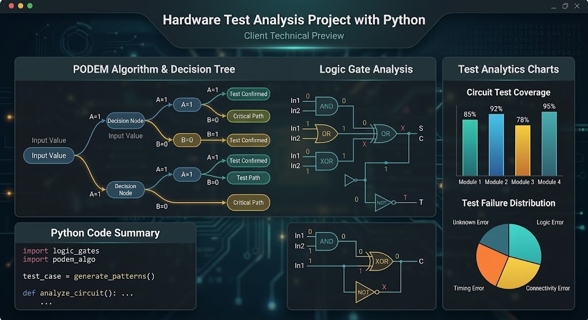

# ATPG, PODEM, and SCOAP Testability Analysis

<div align="center">
  
  
  
  
</div>

<p align="center">
  
</p>

This repository contains a modular Python implementation of testability analysis for combinational digital circuits. It combines two coursework phases in one project:

- **Phase one:** four-valued logic simulation and timing-aware propagation.
- **Phase two:** SCOAP controllability/observability analysis and PODEM automatic test-pattern generation.

The project supports ISCAS-style netlists, single stuck-at faults, and benchmark circuits such as `c1`, `c5`, `c17`, `c432`, `c6288`, and `c7552`.

## Project Workflow

The single entry point runs all analyses for the selected circuit through a Command Line Interface (CLI):

```text
ISCAS netlist + input values + fault list
                    |
                    v
        Phase 1: true values and delay
                    |
                    v
        Phase 2: SCOAP and PODEM ATPG
                    |
                    v
                 output/